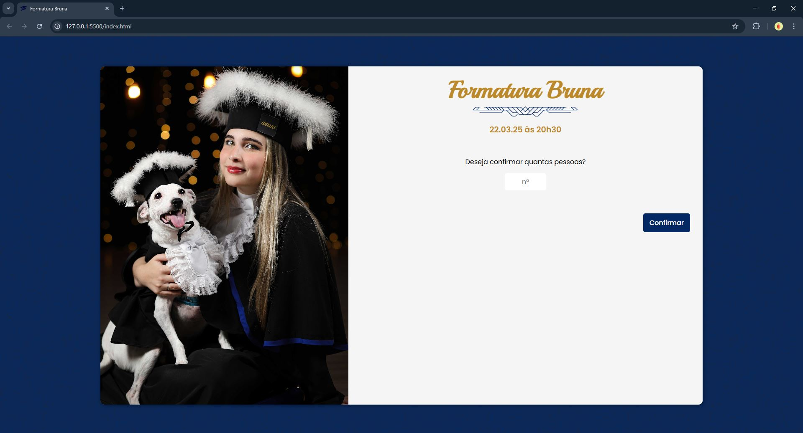
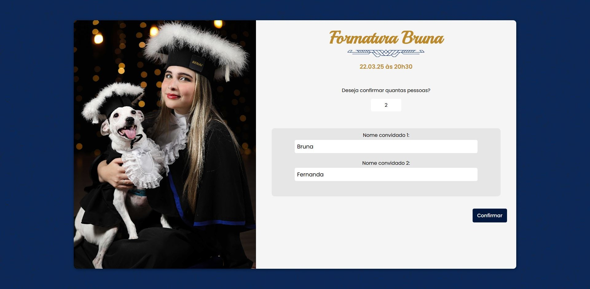

[HTML_BADGE]: https://img.shields.io/badge/html5-%23E34F26.svg?style=for-the-badge&logo=html5&logoColor=white
[CSS_BADGE]: https://img.shields.io/badge/css3-%231572B6.svg?style=for-the-badge&logo=css3&logoColor=white
[JS_BADGE]: https://img.shields.io/badge/javascript-%23323330.svg?style=for-the-badge&logo=javascript&logoColor=%23F7DF1E
[PROJECT__BADGE]: https://img.shields.io/badge/📱Visit_this_project-000?style=for-the-badge&logo=project
[PROJECT__URL]: https://brunaciarlo.github.io/confirmacao-presenca/

<h1 align="center" style="font-weight: bold;"> 📅 Confirmação de Presença ☑️ </h1>

🌐 <a href="#ingles"> _English README </a> below the portuguese_

![HTML_BADGE]
![CSS_BADGE]
![JS_BADGE]

  <a href="#sobre">Sobre</a> • 
  <a href="#comecando">Começando</a>

  
  
  
  

<h2 id="sobre">📖 Sobre</h2>

Este projeto consiste em um site responsivo para confirmação de presença em eventos, desenvolvido para a minha festa de formatura. O site permite que o usuário informe quantos convidados deseja confirmar e insira os nomes de cada um em um formulário dinâmico.
A versão original realizava o envio dos dados para uma planilha Google Sheets via Google Apps Script, funcionalidade desativada por motivos de segurança para publicação no portfólio.

<h4>🔐 Segurança</h4>
Este projeto originalmente enviava os dados de confirmação de presença para uma Planilha (Google Sheets) usando um endpoint via Google Apps Script.
Para fins de segurança, esse endpoint foi removido nesta versão publicada. A estrutura do código permanece para fins demonstrativos, e o botão de "Confirmar" redireciona diretamente para a página de confirmação, com um timeout de 1.5s para simular a experiência real de carregamento.

[![project][PROJECT__BADGE]][PROJECT__URL]
---------------------------------------------------------------------------------------------------------------------------------------

<h1 id="ingles" align="center" style="font-weight: bold;">📅 Event Attendance Confirmation ☑️</h1>

![HTML_BADGE]
![CSS_BADGE]
![JS_BADGE]

  <a href="#about">About</a> • 
  <a href="#starting">Getting Started</a>

  
  
  
  

<h2 id="about">📖 About</h2>

This project is a responsive website for RSVP confirmation, originally developed for my graduation party. The user can inform how many guests they want to confirm and enter each of their names in a dynamic form.
The original version submitted the data to a Google Sheet using Google Apps Script, but this functionality has been disabled for security reasons in this public portfolio version.

<h4>🔐 Security</h4> 

This project originally sent RSVP data to a Google Sheet through a Google Apps Script endpoint. For security purposes, that endpoint has been removed in this published version. The code structure remains for demonstration purposes, and the "Confirm" button redirects directly to the confirmation page after a 1.5s timeout to simulate a real loading experience.
